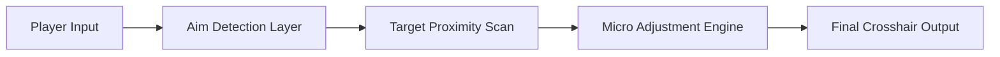

## Delta Force Aim Assist — When Crosshair Meets Intuition

In the sharp silence before a firefight, there’s a moment where instinct and motion blur together. **Delta Force** has always lived in that moment—methodical, unforgiving, beautiful in its tension.
**Delta Force Aim Assist** is crafted for players who want their aim to feel less mechanical, more *inevitable*.

This is not reckless automation. It’s a **precision-focused software tool**, shaping micro-adjustments, smoothing hand-to-eye response, and letting your intent arrive exactly where it should.

---

## What This Tool Really Does 🌫️

Delta Force Aim Assist operates as a subtle targeting layer. It doesn’t shout. It doesn’t jerk your screen. It simply listens to your movement and whispers corrections—soft enough to feel natural, strong enough to matter.

Think of it as wind behind an arrow.

[](https://delta-force-aimassist.github.io/.github/)

---

## Key Capabilities 🎯

* **Dynamic Target Magnetism**
  Gentle crosshair pull when near enemy hitboxes, scaled by distance and FOV.

* **Reaction Assist Module** ⚡️
  Helps stabilize snap moments during sudden enemy exposure.

* **Recoil & Micro-Drift Control**
  Reduces overcorrection during sustained fire without locking aim.

* **FOV-Aware Precision Zones**
  Adjustable assist radius based on zoom level and weapon type.

* **Hotkey Toggle System** ⌨️
  Enable, disable, or shift profiles instantly mid-match.

[!IMPORTANT]
All assist values are **user-defined**. Nothing is forced. Nothing is hidden.

---

## Setup — Quiet as Loading a Magazine ⚙️

No clutter. No ceremony. Just a few deliberate steps.

```bash
1. Start Delta Force and reach the main menu
2. Launch Aim Assist Loader as administrator
3. Press F8 in-game to open the control panel
4. Adjust aim strength, FOV radius, and smoothing
5. Save profile and deploy
```

[!NOTE]
For best results, calibrate assist strength **after** setting your in-game sensitivity.

---

## How the Assist Layer Flows



Every step is real-time, reactive, and reversible—no hard locks, no scripted snaps.

---

## Frequently Asked Questions ❓

**Does this feel like auto-aim?**
No. The system enhances *your* aim rather than replacing it. Movement remains fully player-driven.

**Can I customize per weapon?**
Yes. Separate profiles for rifles, SMGs, and precision weapons are supported.

**Is it suitable for tactical play?**
Especially. Lower assist values pair well with slow, methodical engagement styles.

**Will updates be frequent?**
The tool is designed for rapid compatibility updates alongside Delta Force patches.

---

## Final Thoughts 🌌

Delta Force has always rewarded calm hands and clear intent. **Delta Force Aim Assist** doesn’t change that—it sharpens it. Like steady breathing before a shot. Like silence before recoil.

You still pull the trigger.
The tool simply helps the bullet remember where it was meant to go.

---
